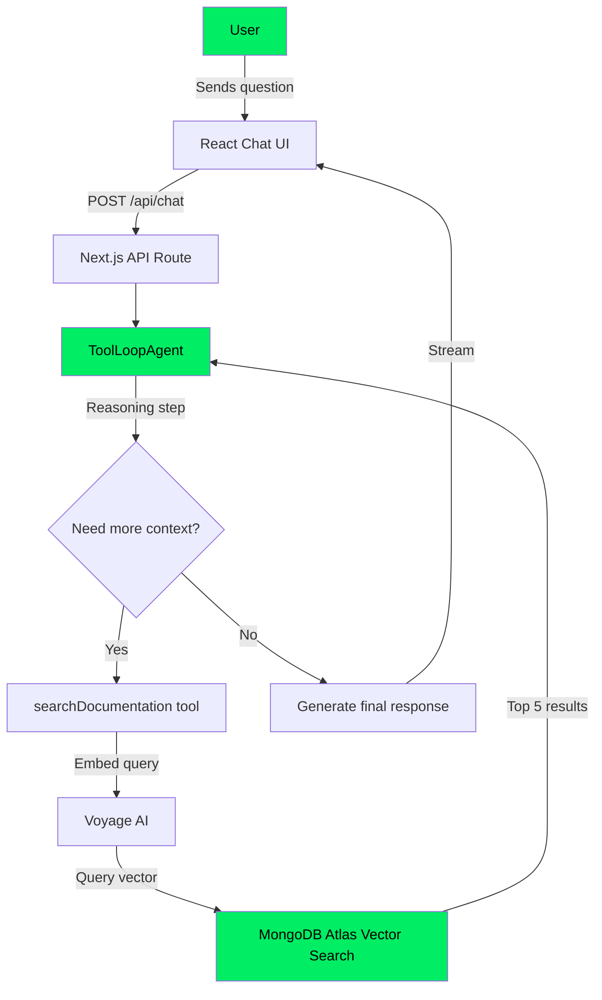

# RAG Agent Demo — How to Create an AI Agent with Minimal Coding

Companion project for the **"How to Create an AI Agent with Minimal Coding"** video. This demo builds a fully functional RAG (Retrieval-Augmented Generation) agent that answers questions about the MongoDB Brand Book using MongoDB Atlas Vector Search, Voyage AI embeddings, and the Vercel AI SDK's `ToolLoopAgent`.

## What It Does

A chat-based AI agent that:

1. Receives a user question about MongoDB brand guidelines
2. Autonomously decides whether to search the brand book
3. Embeds the query with Voyage AI and runs a vector search on MongoDB Atlas
4. Synthesizes a grounded answer from the retrieved documents

The agent uses an **agentic loop** — it reasons, calls tools, inspects results, and repeats until it has enough context to respond. All in ~5 files of code.

## Architecture



## Tech Stack

| Layer | Technology |
|-------|-----------|
| Frontend | React 19, Next.js 16 (App Router), Tailwind CSS v4 |
| Agent Framework | Vercel AI SDK v6 (`ToolLoopAgent`) |
| LLM | Google Gemini Flash |
| Embeddings | Voyage AI (`voyage-4-large` for ingestion, `voyage-4-lite` for queries) |
| Database | MongoDB Atlas with Vector Search |
| Language | TypeScript |

## Project Structure

```
src/
  app/
    page.tsx              # Chat UI (React client component)
    layout.tsx            # Root layout, fonts, metadata
    globals.css           # Tailwind theme (dark mode, MongoDB green)
    api/chat/route.ts     # POST endpoint — streams agent responses
  lib/
    agent.ts              # ToolLoopAgent config (model, system prompt, tools)
    tools.ts              # searchDocumentation tool (embeddings + vector search)
    mongodb.ts            # MongoDB connection pooling
scripts/
  ingest.ts               # Embeds and loads brand book chunks into MongoDB
```

## Prerequisites

- Node.js 18+
- A [MongoDB Atlas](https://www.mongodb.com/cloud/atlas) cluster
- [Google AI Studio](https://aistudio.google.com/) API key (for Gemini Flash)
- [Voyage AI](https://www.voyageai.com/) API key (for embeddings)

## Setup

### 1. Install dependencies

```bash
npm install
```

### 2. Configure environment variables

Create a `.env.local` file:

```
MONGODB_URI=mongodb+srv://<user>:<password>@<cluster>.mongodb.net/
GOOGLE_GENERATIVE_AI_API_KEY=your-gemini-api-key
VOYAGE_AI_API_KEY=your-voyage-ai-api-key
```

### 3. Ingest the brand book data

```bash
npx ts-node scripts/ingest.ts
```

This embeds 14 brand book sections with Voyage AI, inserts them into the `brand_demo.brand_book` collection, and automatically creates the Atlas Vector Search index. The index may take a minute to become ready after creation.

### 4. Run the app

```bash
npm run dev
```

Open [http://localhost:3000](http://localhost:3000).

## How the Agent Works

The core of the project is `src/lib/agent.ts` — a `ToolLoopAgent` that:

- Uses **Gemini Flash** as the reasoning LLM
- Has a single tool: `searchDocumentation` (vector search over the brand book)
- Runs up to **10 steps** before stopping (safety limit)
- **Streams** responses in real-time back to the UI

When a user asks a brand-related question, the agent autonomously decides to call `searchDocumentation`, which:

1. Embeds the query using Voyage AI (`voyage-4-lite` for fast query-time embedding)
2. Runs a `$vectorSearch` aggregation on MongoDB Atlas (top 5 results, 15 candidates)
3. Returns the matched sections with relevance scores

The agent then uses the retrieved context to generate a grounded, accurate response.

## License

MIT
