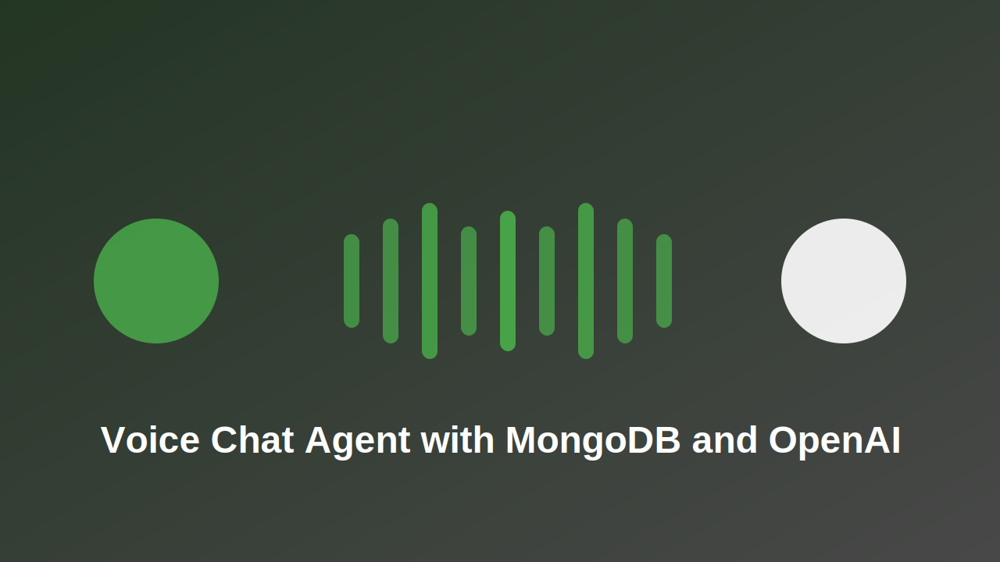

#  Voice Agent with MongoDB Atlas Vector Search



This is the Agent application that provides voice interaction capabilities powered by [MongoDB vector search](https://www.mongodb.com/docs/atlas/atlas-vector-search/vector-search-overview/) and [OpenAI realtime API](https://openai.com/index/introducing-the-realtime-api/).

Inspired by [Voice React Agent by LangChain](https://github.com/langchain-ai/react-voice-agent)

> Create by [Pavel Duchovny](https://www.linkedin.com/in/pavel-duchovny-60573275/) with ❤️

## Demo 
[](https://youtu.be/USmcc8biu6M)


## Prerequisites

- Python 3.8+
- MongoDB Atlas account and cluster with Vector Search compatible (8.0+ prefared)
- OpenAI API key
- Node.js and npm (for running the client)

## Setup

1. Create a `.env` file in the server directory with your MongoDB Atlas connection string:
```
MONGODB_ATLAS_URI=your_connection_string_here
OPENAI_API_KEY=your_openai_api_key
```

2. Install dependencies:
```bash
pip install uv
pip install -r requirements.txt
```


## Data Ingestion

This application uses the [MongoDB AirBnB Embeddings dataset](https://huggingface.co/datasets/MongoDB/airbnb_embeddings) which contains property descriptions, reviews, and metadata along with text and image embeddings.

To ingest the dataset into your MongoDB Atlas cluster:

```python
from pymongo import MongoClient
from bson import json_util
from pymongo.operations import SearchIndexModel
import json
import time
import os
from datasets import load_dataset

client = MongoClient(os.environ['MONGODB_ATLAS_URI'])
db = client['ai_airbnb']
collection = db['rentals']

db.create_collection("rentals")

# create index 
search_index_model = SearchIndexModel(
  definition={
    "fields": [
      {
        "type": "vector",
        "numDimensions": 1536,
        "path": "text_embeddings",
        "similarity": "cosine"
      },
    ]
  },
  name="vector_index",
  type="vectorSearch",
)
result = collection.create_search_index(model=search_index_model)
print("New search index named " + result + " is building.")
# Wait for initial sync to complete
print("Polling to check if the index is ready. This may take up to a minute.")
predicate=None
if predicate is None:
  predicate = lambda index: index.get("queryable") is True
while True:
  indices = list(collection.list_search_indexes(result))
  if len(indices) and predicate(indices[0]):
    break
  time.sleep(5)
print(result + " is ready for querying.")

# Load and ingest the dataset
dataset = load_dataset("MongoDB/airbnb_embeddings")

insert_data = []

# Iterate through the dataset and prepare the documents for insertion
# The script below ingests 1000 records into the database at a time
for item in dataset['train']:
    # Convert the dataset item to MongoDB document format
    doc_item = json_util.loads(json_util.dumps(item))
    insert_data.append(doc_item)

    # Insert in batches of 1000 documents
    if len(insert_data) == 1000:
        collection.insert_many(insert_data)
        print("1000 records ingested")
        insert_data = []

# Insert any remaining documents
if len(insert_data) > 0:
    collection.insert_many(insert_data)
    print("{} records ingested".format(len(insert_data)))

print("All records ingested successfully!")

bookings = db['bookings']

## Create Atlas Search index

db.create_collection("bookings")
search_index_model = SearchIndexModel(
  definition={
     "mappings": {
                "dynamic": True
            }
  },
  name="default"
)

result = bookings.create_search_index(model=search_index_model)
print("New search index named " + result + " is building.")
# Wait for initial sync to complete
print("Polling to check if the index is ready. This may take up to a minute.")
predicate=None
if predicate is None:
  predicate = lambda index: index.get("queryable") is True
while True:
  indices = list(bookings.list_search_indexes(result))
  if len(indices) and predicate(indices[0]):
    break
  time.sleep(5)
print(result + " is ready for querying.")


client.close()
```

The dataset contains:

- Property descriptions and metadata
- Text embeddings (1536 dimensions) created using OpenAI's text-embedding-3-small model
- Image embeddings (512 dimensions) created using OpenAI's clip-vit-base-patch32 model

The vector search index is created on the text embeddings field to enable semantic search capabilities.

## Running the Server

Start the Flask server:

```bash
uv run src/server/app.py
```

The server will be available at http://localhost:3000

## How It Works

The application combines voice interaction with vector search to create a natural language interface for querying AirBnB listings:

1. Voice input is processed through audio worklets and converted to text
2. The text query is processed by the LangChain agent (defined in prompt.py)
3. The agent uses custom tools (defined in tools.py) to:
   - Search the vector database for relevant listings
   - Format responses for natural conversation
4. Responses are converted back to speech and streamed to the client

### Core Components

- **prompt.py**: Defines the LangChain agent's behavior and conversation style
- **tools.py**: Implements custom tools for vector search and response formatting
- **Audio Worklets**: Handle real-time audio processing in the browser

## API Documentation

The server provides a voice-enabled interface for interacting with the AirBnB dataset through the following endpoints:

### Audio Processing
- `/process-audio`: Handles real-time audio input processing using WebAudio worklets
- `/synthesize`: Converts text responses to speech
- `/stream-audio`: Streams synthesized audio back to the client

### Vector Search
- `/search`: Performs semantic search against the AirBnB dataset using vector embeddings
- `/query`: Processes natural language queries and returns relevant property matches

### Audio Worklets
The server includes two audio worklet processors in the static directory:
- `audio-playback-worklet.js`: Handles audio playback and streaming
- `audio-processor-worklet.js`: Processes incoming audio input

## Project Structure
```
voice-openai-mongo-rentals-agent/
├── src/
│   └── server/
│       ├── static/
│       │   ├── audio-playback-worklet.js
│       │   └── audio-processor-worklet.js
│       ├── app.py
│       ├── prompt.py
│       └── tools.py
├── requirements.txt
└── README.md
```

## License

MIT License
