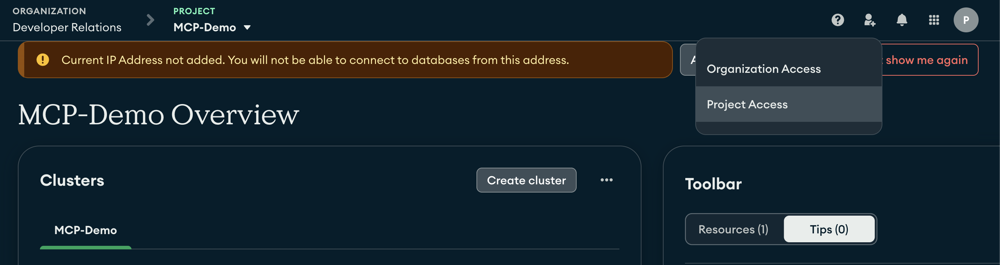
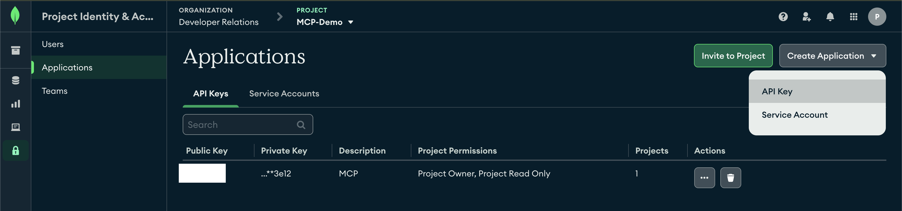

# Model Context Protocol (MCP) Servers

This directory contains information about Model Context Protocol (MCP) servers that extend AI capabilities by providing tools and resources for interacting with external systems and APIs.

## Available MCP Servers

| Repository | Description | Features/Tools | Use Case | Integration tools |
|------------|-------------|----------------|-------------|-------------|
| [mongodb-developer/mcp-mongodb-atlas](https://github.com/mongodb-developer/mcp-mongodb-atlas) | An MCP server for managing MongoDB Atlas projects. Provides tools for creating and managing MongoDB Atlas clusters, users, and network access through the MCP interface. | • `create_atlas_cluster` - Create a new MongoDB Atlas cluster<br>• `setup_atlas_network_access` - Configure network access<br>• `create_atlas_user` - Create a new database user<br>• `get_atlas_connection_strings` - Retrieve connection strings<br>• `list_atlas_projects` - List all Atlas projects<br>• `list_atlas_clusters` - List all clusters in a project | Create and manage MongoDB Atlas resources from AI assistants | **VSCode (Cline)**:<br>Add to `cline_mcp_settings.json`<br><br>**Cursor**:<br>Add to MCP settings or `~/.cursor/mcp.json`<br><br>**Claude Desktop**:<br>Add to `claude_desktop_config.json` |
| [mongodb-developer/mongodb-mcp-server](https://github.com/mongodb-developer/mongodb-mcp-server) | An MCP server providing read-only access to MongoDB databases. Enables inspection of collection schemas and execution of aggregation pipelines. | • `aggregate` - Execute aggregation pipelines<br>• `explain` - Get execution plans for pipelines<br>• Resource: Collection Schemas (`mongodb://<host>/<collection>/schema`) | Inspect schemas and run aggregations from AI assistants | **Claude Desktop**:<br>Add to `claude_desktop_config.json` (see repo README for details) |

## Usage Examples

### MongoDB Atlas MCP Server

#### Command Line Usage
```bash
# Using environment variables
export ATLAS_PUBLIC_KEY="your-public-key"
export ATLAS_PRIVATE_KEY="your-private-key"
npx mcp-mongodb-atlas

# Or passing keys as arguments
npx mcp-mongodb-atlas "your-public-key" "your-private-key"
```

#### Configuration Example (Cline VSCode Extension)
```json
{
  "mcpServers": {
    "atlas": {
      "command": "npx",
      "args": ["mcp-mongodb-atlas"],
      "env": {
        "ATLAS_PUBLIC_KEY": "your-public-key",
        "ATLAS_PRIVATE_KEY": "your-private-key"
      },
      "disabled": false,
      "autoApprove": []
    }
  }
}
```

### MongoDB MCP Server (Database Interaction)

#### Command Line Usage
```bash
# Set the MongoDB connection string environment variable
export MONGODB_URI="mongodb+srv://<user>:<password>@<your-cluster-url>/<database>?retryWrites=true&w=majority" 
npx -y @pash1986/mcp-server-mongodb

# Or pass the URI as an argument (ensure proper quoting)
npx -y @pash1986/mcp-server-mongodb "mongodb+srv://<user>:<password>@<your-cluster-url>/<database>?retryWrites=true&w=majority"
```

#### Configuration Example (Claude Desktop)
Add the following to the `mcpServers` section in `claude_desktop_config.json`:
```json
{
  "mongodb": {
    "command": "npx",
    "args": [
      "-y",
      "@pash1986/mcp-server-mongodb"
    ],
    "env": {
      "MONGODB_URI": "mongodb+srv://<user>:<password>@<your-cluster-url>/<database>?retryWrites=true&w=majority"
    },
    "disabled": false,
    "autoApprove": [] 
  }
}
```
*Replace `<user>`, `<password>`, `<your-cluster-url>`, and `<database>` with your actual credentials and database name.*

#### Configuration Example (Cursor)
Add the following to your MCP settings or `~/.cursor/mcp.json`:
```json
{
  "mongodb": {
    "command": "npx",
    "args": [
      "-y",
      "@pash1986/mcp-server-mongodb"
    ],
    "env": {
      "MONGODB_URI": "mongodb+srv://<user>:<password>@<your-cluster-url>/<database>?retryWrites=true&w=majority"
    },
    "disabled": false,
    "autoApprove": [] 
  }
}
```
*Replace `<user>`, `<password>`, `<your-cluster-url>`, and `<database>` with your actual credentials and database name.*


## Getting Started

To use an MCP server:

1. Install the required package (if applicable)
2. Configure the server in your AI assistant's MCP settings
3. Provide any necessary API keys or credentials
    4. For MongoDB Atlas, obtain API keys by:
    - Log in to [MongoDB Atlas](https://www.mongodb.com/cloud/atlas)
    - Navigate to Identity & Access Management > Project Access

    

    - Choose Applications:

    

    - Create a new API Key with appropriate permissions
    - Save both the Public and Private keys securely
    - Use these keys in your MCP server configuration
4. Restart your AI assistant to connect to the MCP server

## Contributing

If you've developed an MCP server that you'd like to add to this list, please submit a pull request with your server's information added to the table above.
