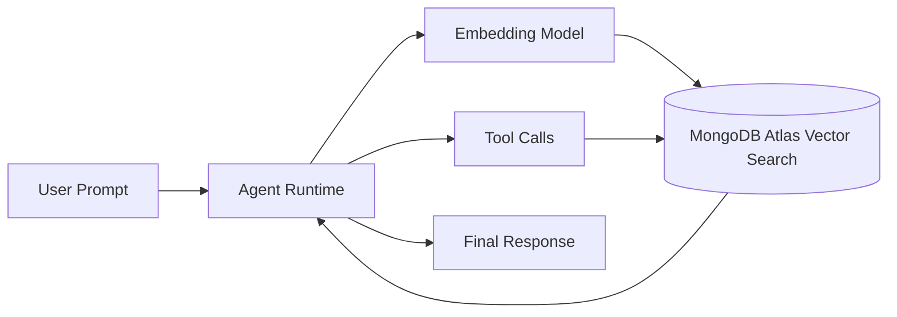

# AI Agent Notebooks with MongoDB Atlas

Build production-style AI agents using MongoDB Atlas as the operational data store,
memory layer, and retrieval backend. This folder focuses on practical agent
patterns across LangGraph, LangChain, LlamaIndex, PydanticAI, and other
frameworks.

## Capabilities

- Agentic RAG with retrieval over MongoDB Atlas data
- Tool-using agents (search, memory, structured data access)
- Text-to-MQL and database-aware reasoning patterns
- Multi-provider workflows (OpenAI, Anthropic, Gemini, Voyage AI, and others)

## Quick Start

Prerequisites:
- Python 3.10+
- A MongoDB Atlas cluster and connection string
- API keys required by the selected notebook (for example OpenAI, Anthropic, Voyage AI)

Basic setup:

```bash
python -m venv .venv
source .venv/bin/activate
pip install -U pip notebook
jupyter notebook
```

Then open one notebook from this folder and run cells top-to-bottom.

Expected outcome:
- Notebook runs end-to-end and returns agent responses grounded in retrieved data.

## Architecture Overview

Most notebooks in this folder follow this flow:



## Why MongoDB

MongoDB Atlas is used because these notebooks need one data platform for document
storage, operational memory, and vector retrieval. In practice this enables fast
iteration on agent workflows without splitting state across multiple systems.

Relevant docs:
- [MongoDB Vector Search](https://www.mongodb.com/docs/atlas/atlas-vector-search/?utm_campaign=devrel&utm_content=genai.showcase)
- [MongoDB Aggregations](https://www.mongodb.com/docs/manual/aggregation/?utm_campaign=devrel&utm_content=genai.showcase)

## Data Bootstrap

Most notebooks include setup cells that create collections/indexes or load sample
documents. Re-run setup cells before querying if your cluster is empty.

## Troubleshooting

- Authentication or connection failures:
	verify your Atlas URI and network access settings.
- Empty retrieval results:
	ensure setup/ingestion cells were executed and vector indexes are ready.
- API provider errors:
	confirm required environment variables are set in your notebook kernel.

## Notebook Catalog

| Title | Stack | Notebook |
|-------|-------|----------|
| Self-Reflecting Gift Agent | MongoDB Atlas, Haystack | [](https://github.com/mongodb-developer/GenAI-Showcase/blob/main/notebooks/agents/self_reflecting_gift_agent_haystack.ipynb) |
| Building AI Agent with Claude | MongoDB Atlas, Claude, LlamaIndex | [](https://github.com/mongodb-developer/GenAI-Showcase/blob/main/notebooks/agents/how_to_build_ai_agent_claude_3_5_sonnet_llamaindex_mongodb.ipynb) |
| Building AI Agent with OpenAI | MongoDB Atlas, OpenAI, LlamaIndex | [](https://github.com/mongodb-developer/GenAI-Showcase/blob/main/notebooks/agents/how_to_build_ai_agent_openai_llamaindex_mongodb.ipynb) |
| Self-Reflecting Cooking Agent | MongoDB Atlas, Haystack | [](https://github.com/mongodb-developer/GenAI-Showcase/blob/main/notebooks/agents/MongoDB_Haystack_self_reflecting_Cooking_agent.ipynb) |
| Multi-Agent Micro Agents | MongoDB Atlas, SmoLAgents | [](https://github.com/mongodb-developer/GenAI-Showcase/blob/main/notebooks/agents/smolagents_multi-agent_micro_agents.ipynb) |
| SmoLAgents with MongoDB | MongoDB Atlas, SmoLAgents, Hugging Face | [](https://github.com/mongodb-developer/GenAI-Showcase/blob/main/notebooks/agents/smolagents_hf_with_mongodb.ipynb) |
| AI Agent with PydanticAI | MongoDB Atlas, PydanticAI | [](https://github.com/mongodb-developer/GenAI-Showcase/blob/main/notebooks/agents/ai_agent_with_pydanticai_and_mongodb.ipynb) |
| Gemini 2.0 Multi-Modality | MongoDB Atlas, Gemini 2.0 | [](https://github.com/mongodb-developer/GenAI-Showcase/blob/main/notebooks/agents/Gemini2_0_multi_modality_with_mongodb_atlas_vector_store.ipynb) |
| AWS Bedrock Agent | MongoDB Atlas, AWS Bedrock | [](https://github.com/mongodb-developer/GenAI-Showcase/blob/main/notebooks/agents/mongodb_with_aws_bedrock_agent.ipynb) |
| Working Memory with Tavily | MongoDB Atlas, Tavily | [](https://github.com/mongodb-developer/GenAI-Showcase/blob/main/notebooks/agents/implementing_working_memory_with_tavily_and_mongodb.ipynb) |
| HR Agentic Chatbot | MongoDB Atlas, LangGraph, Claude | [](https://github.com/mongodb-developer/GenAI-Showcase/blob/main/notebooks/agents/hr_agentic_chatbot_with_langgraph_claude.ipynb) |
| CrewAI with MongoDB | MongoDB Atlas, CrewAI | [](https://github.com/mongodb-developer/GenAI-Showcase/blob/main/notebooks/agents/crewai-mdb-agg.ipynb) | [](https://github.com/mongodb-developer/GenAI-Showcase/blob/main/notebooks/agents/mongodb_voyage_ai_openai_rag_hybrid_agentic_sports_scores.ipynb)  |
| Asset Management Assistant | MongoDB Atlas, LangGraph | [](https://github.com/mongodb-developer/GenAI-Showcase/blob/main/notebooks/agents/asset_management_analyst_assistant_agentic_chatbot_langgraph_mongodb.ipynb) |
| Airbnb Agent | MongoDB Atlas, OpenAI, LlamaIndex | [](https://github.com/mongodb-developer/GenAI-Showcase/blob/main/notebooks/agents/airbnb_agent_openai_llamaindex_mongodb.ipynb) |
| Factory Safety Assistant | MongoDB Atlas, LangGraph, LangChain | [](https://github.com/mongodb-developer/GenAI-Showcase/blob/main/notebooks/agents/agentic_rag_factory_safety_assistant_with_langgraph_langchain_mongodb.ipynb) |
| Fireworks AI Agent | MongoDB Atlas, Fireworks AI, LangChain | [](https://github.com/mongodb-developer/GenAI-Showcase/blob/main/notebooks/agents/agent_fireworks_ai_langchain_mongodb.ipynb) |
| RetrieveChat Agent | MongoDB Atlas, AgentChat | [](https://github.com/mongodb-developer/GenAI-Showcase/blob/main/notebooks/agents/agentchat_RetrieveChat_mongodb.ipynb) |
| Zero to Hero with GenAI | MongoDB Atlas, OpenAI | [](https://github.com/mongodb-developer/GenAI-Showcase/blob/main/notebooks/agents/zero_to_hero_with_genai_with_mongodb_openai.ipynb) |
| MongoDB with OpenAI RAG/Agentic SDK & Voyage AI Hybrid Search | MongoDB, OpenAI, VoyageAI | [](https://github.com/mongodb-developer/GenAI-Showcase/blob/main/notebooks/agents/mongodb_voyage_ai_openai_rag_hybrid_agentic_sports_scores.ipynb) |
| Text To MQL Agent | MongoDB, LangChain, LangGraph | [](https://github.com/mongodb-developer/GenAI-Showcase/blob/main/notebooks/agents/mongodb_building_a_text_to_mql_agent.ipynb) |
| AI Video and Scene Intelligence | MongoDB, OpenAI, Voyage AI | [](https://github.com/mongodb-developer/GenAI-Showcase/blob/main/notebooks/agents/video_intelligence_agent.ipynb) |
